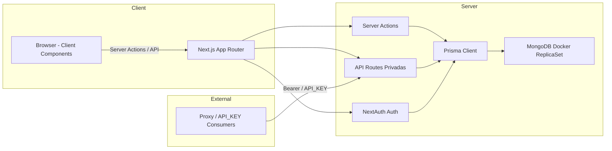

# Desarrollo de StockFlow

Este documento recoge el plan inicial y los pasos inmediatos para poner en marcha el proyecto StockFlow. Es un borrador vivo: se actualizará según avance el desarrollo.

**Objetivo:** Crear una aplicación con Next.js que utilice Server Actions cuando sea apropiado, para componentes del lado del servidor pero también en una API privada que permita la conexión con otros sistemas y con una capa de datos en MongoDB gestionada por Prisma, validación con Zod y una UI sencilla en el frontend.

**Stack y herramientas (propuesta):**
- **Frontend / framework:** Next.js
- **Base de datos:** MongoDB (contenedor Docker para desarrollo local)
- **ORM:** Prisma
- **Validación:** Zod
- **Autenticación:** NextAuth
- **Utilidades:** Docker, Yarn, Visual Studio Code, Copilot (solo para UI)

## Checklist — Pasos inmediatos

- [ ] Inicializar proyecto Next.js.
- [ ] Crear repositorio en GitHub y subir el primer commit.
- [ ] Definir el esquema de Prisma para MongoDB.
- [ ] Levantar MongoDB en Docker (contenedor para desarrollo local).
- [ ] Configurar replica set si Prisma/feature lo requiere.
- [ ] Establecer variables de entorno en `.env` (ej. `DATABASE_URL`, `NEXTAUTH_SECRET`, `API_KEY`).
- [ ] Aplicar esquema de Prisma: `npx prisma db push`.
- [ ] Crear esquemas Zod para validación en server actions.
- [ ] Implementar Server Actions / API endpoints básicos por modelo.
- [ ] Construir formularios y tablas en frontend (adaptables a Server Actions o API).
- [ ] Añadir autenticación básica con NextAuth y proteger rutas necesarias.

## Notas y decisiones

- Usaré Server Actions cuando simplifiquen el flujo; si hace falta, expondré la misma funcionalidad vía API para permitir elección desde el frontend.
- Copilot se usará únicamente para la capa de UI; revisaré manualmente todo código de servidor.
- Evaluaré si es necesario usar Mongoose además de Prisma; la intención es preferir Prisma cuando cubra las necesidades.
- La API usará server actions para cemtralizar la lógica de negocio y mantener los principios SOLID

## Problemas y soluciones (MongoDB / Replica Set)

- Síntoma: al ejecutar `rs.initiate()` en `mongosh` apareció un error de "Server selection timeout" o "ReplicaSetNoPrimary".
- Causa común: el replica set no quedó con un PRIMARY o la configuración de hosts no coincide con cómo se exponen los puertos desde el contenedor.
- Pasos de corrección que funcionaron:

```js
// En el shell del contenedor
rs.initiate({
  _id: "rs0",
  members: [{ _id: 0, host: "localhost:27017" }]
})

// Si es necesario reconfigurar:
cfg = rs.conf()
cfg.members[0].host = "localhost:27017"
rs.reconfig(cfg, { force: true })
```

- Nota: dependiendo de cómo estés conectando (desde el host o desde otro contenedor), puede que debas usar el nombre del contenedor o la IP en lugar de `localhost`. Revisa `rs.status()` y los logs del contenedor si persisten los problemas.

## Dependencias añadidas 

- `zod@3.25.76` - Manejo de validación de datos
- `bcryptjs@^3.0.2` - Encriptación de contra
- `next-auth@^5.0.0-beta.4` - Manejo de autenticación mediante JWT
- `recharts@2.15.4` - Gráficas visuales
- `sonner@^1.7.4` - Elementos de confirmaciones visuales
- `@hookform/resolvers@^3.10.0` - Uso de zod con react hook form
- `lucide-react@^0.454.0` - Íconos de react

## Avances recientes

- Ya tengo levantado el proyecto con Next.js y la base de datos local en MongoDB mediante Docker.
- Ya pude conectar Prisma con MongoDB y ejecutar `npx prisma db push` sin errores.
- Ya construí la base del panel con un sidebar responsive y un layout general para el área privada.
- Ya implementé el CRUD de categorías y el de tiendas siguiendo el mismo patrón de tabla, formulario modal, paginación y búsqueda.
- Ya avancé en el CRUD de productos, incluyendo el selector de categoría y la captura de stock por tienda.
- Ya confirmé que el error de hidratación que aparecía en el navegador venía de una extensión y no de mi código.
- Creé las rutas de API privadas y bloqueadas por un proxy 

## Decisiones técnicas que fui tomando

- Decidí mantener una interfaz más tipo SaaS, sobria y clara, en lugar de un estilo demasiado futurista.
- Decidí reutilizar el mismo patrón visual y funcional para módulos como categorías, tiendas y productos, para no duplicar comportamientos innecesarios.
- Decidí dejar los formularios como componentes cliente y las consultas/acciones como server actions para conservar un flujo simple.
- Decidí manejar el stock como una entidad separada por tienda, en vez de intentar meterlo dentro del producto como un campo más.
- Decidí usar validaciones con Zod y ajustar los schemas a lo que realmente necesito mandar desde el formulario.
- Decidí que el `page.tsx` de productos cargue categorías y tiendas desde el servidor para poder alimentar los selectores del formulario.
- Aunque pude haber implementado la API desde el front, al tener el back y front juntos mediante server actions, preferí utilizarlas y mostrar retroalimentación con modales como toast, para mejorar la experiencia de usuario y evitar llamadas innecesarias al servidor (no obstante creé la API).

## Lecciones aprendidas

- En MongoDB con Prisma, si el modelo depende de relaciones, conviene pensar desde el inicio cómo voy a sincronizar los hijos relacionados, no solo el registro principal.
- Si el formulario manda filas vacías o datos incompletos, la validación se rompe antes de llegar a Prisma, así que vale más filtrar y normalizar desde el UI.
- El comportamiento visual del proyecto mejora mucho cuando el panel tiene un layout base consistente y los módulos comparten estructura.

## Conclusión

- Tomé decisiones técnicas que tal vez no eran las documentadas, sin embargo que creo que cumplen con los criteríos y solución del problema mediante software, así como permitir una estructura y arquitectura con los principios SOLID que permitan expandir el sistema fácilmente.


## Herramientas usadas en el flujo de trabajo

- Editor / IDE: Visual Studio Code
- Extensiones y asistentes: GitLens, ESLint, Prettier, GitHub Copilot (usado sólo para sugerencias UI), Sonner para toasts en UI
- Control de versiones: Git + GitHub (fork/branches)
- Runtime / paquetes: Node.js, Yarn / npm
- Base de datos: MongoDB (contenedor Docker, `mongosh` para administración)
- ORM / DB client: Prisma (generador + `prisma generate`)
- Validación y formularios: Zod, `react-hook-form`, `@hookform/resolvers`
- Autenticación: NextAuth
- UI / estilos: Tailwind CSS, lucide-react (iconos)
- Observabilidad / debugging: `console.log` en server actions para diagnóstico (especialmente `auth.authorize` en producción)

## Diagrama de arquitectura (Mermaid)



## Decisiones técnicas más importantes (y por qué)

1) Usar Server Actions para la lógica de negocio (acciones server-side)

- Por qué: simplifica el flujo de formularios y mantiene la validación y la coherencia en el servidor sin crear endpoints REST duplicados. Permite mantener la UI reactiva y eliminar roundtrips manuales desde el cliente cuando no son necesarios.
- Implicaciones: facilita el desarrollo rápido y reduce código de cliente, pero si se necesita interoperabilidad con terceros o colas, hay que exponer rutas API adicionales (ya incluidas).

2) Prisma + MongoDB (preferir Prisma sobre Mongoose aquí)

- Por qué: Prisma ofrece un cliente tipado y una experiencia de modelado declarativa. Usarlo evita mezclar dos formas de acceder a la DB y mantiene consistencia entre modelos y queries.
- Implicaciones: con Mongo hay que tener cuidado con ciertas operaciones relacionales y regenerar el cliente (`npx prisma generate`) después de cambios en `schema.prisma`.

3) Diseñar `Stock` como entidad separada por tienda

- Por qué: mantiene el stock correctamente scoped por tienda, facilita movimientos (transacciones) entre tiendas y evita problemas de concurrencia al actualizar cantidades embebidas en `Product`.
- Implicaciones: requiere joins/consultas adicionales para mostrar stock por producto en una tienda, pero simplifica lógicas de movimiento y control de existencias.


